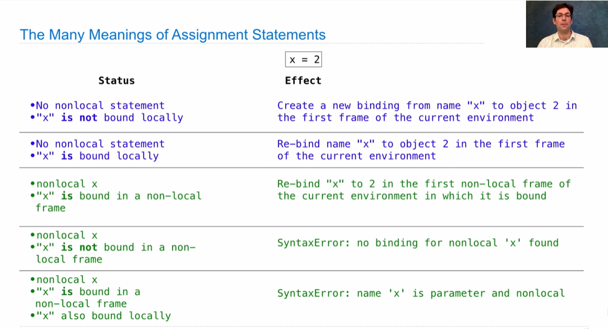

# chapter 2 Object

## Read 2.1 Native Data Types

 `int`, `float`, `bool`, `complex`, and more


## Read 2.2 Data Abstraction

- **data abstraction:** **isolates** how a compound data value is **used** from the details of how it is **constructed**
- **abstraction barriers:** do not violate abstraction barriers. Otherwise, when you want to change the representation of abstract data, you have to rewrite the whole file!


## Read 2.3 Sequences

A sequence is an ordered collection of values, which has a length and supports element selection

- **Lists:** the `add` and `mul` operator
  
  - List's index can be negative number: `lst[-1]` will return the last element of the list
  - `[[]] * 4 ` will create a nested empty list, **but** all the inside list will point to the same memory area. So, you should using `[[] for _ in range(4)]`
  
- **List Comprehensions**: [<map expression> for <name> in <sequence expression> if <filter expression>]

- **Aggregation:** `sum`, `min`, `max`

- built-in functions: `map`, `filter`, `reduce`

- `range`: `list()` function can turn `range` into `list`

- `for` statement:

  ```python
  for <name> in <expression>:
      <suite>
  ```

  - <expression> must yield an iterable value
  - after `for` statement is executed, the <name> will be bound to the last element of the <expression>
  - sequence unpacking

- **Sequence Abstraction:**

  - Membership: `in`,  `not in`
  - Slicing( `[:]` ): will create a new list and return it.

- **String:**
  - A single character is a string, Python do not have `char` data type.
  - also have `add` and `mul` operator
  
- **Trees:**
  
  - *closure property* permits us to create hierarchical structures, like lists
  - depth: how far a node is from the root. The root's depth is 0.
  - height: The depth of the lowest leaf. So if a root tree's depth is 0.


## Read 2.4 Mutable Data

- **Identity:** `is`, `is not` is a stronger condition than equality `==` (opposite to java)
  - `list_a = list_b` is a shallow copy
  - `list_a = list(list_b)` or (`list_a = list_b[:]`) is a deep copy, **however**, they will crash if source_list contains **nested lists**
- **list manipulation:** `[:]`, `list()`, `append()`, `extend()`, `+=`, `pop()`(couldn't pop a empty list, if given a index, will pop the index one), `remove(value)`(will remove the value, if not exist, will cause error), `insert(index, value)`, `count(value)`(count how many times the value appears in the list), `index(value)`(return the index of the value)
- **Tuples:** **immutable**, when a tuple contains a list, the value in the list can change
- **Dictionaries:** `keys()`, `values()`, `items()`, `get(key, default_value)`, supports comprehension syntax.

- **nonlocal:** a general feature of programming languages with higher-order function and lexical scope, nonlocal can also rebind a new function to an existing name.
  - When manipulating function using nonlocal, be aware of 'return tuple'  [disc06  1.2](https://cs61a.org/disc/disc06.pdf)



- **declarative programming:** [2.4.13 Propagating Constraints](http://composingprograms.com/pages/24-mutable-data.html#dictionaries)


## Read 2.5 Object-Oriented Programming

- `method` vs `functions`
- `class attributes` vs `instance attributes`
- wanna hide attributes? name this way: `_attrname`
- **Attribute assignment:** `<expression>.<attribute> = 1` 
  - If expression is a class, it will change the old value or create a new attribute
  - If expression is a instance, it will change the old value or create a *new* attribute, even if exists same name class attribute.

- Multiple Inheritance: when the reference is ambiguous, the priority will follow the order of  father class list, resolves names from left to right


## Read 2.7 Object Abstraction

A central concept in object abstraction is a **generic function**: **using interfaces**, **type dispatching**, **type coercion**

- **operations:** 
  - `repr()` will invokes method `__repr__`
  - `str()` will invokes method `__str__`
  - `__bool__`, `__len__`, `__getitem__`, `__call__`(the instance is callable), `__add__`, `__radd__`

- **Multiple Representations:** there might be more than one useful representation for a data object, and we might like to design systems that can deal with multiple representations. [example: complex numbers can be represented in rectangular form and polar form](http://composingprograms.com/pages/27-object-abstraction.html)

- **Properties:** `@properties` enable the method to be invoked without `()`.

  ​						`@method_name.setter` enable the method change some value without `{}`

- `isinstance(obj, class)`: returns True if `obj` has a type that is or inherits from the `class`

- **Type dispatching:** 

  ```python
  class Number:
      def __add__(self, other):
          if self.type_tag == other.type_tag:
              return self.add(other)
          elif (self.type_tag, other.type_tag) in self.adders:
              return self.cross_apply(other, self.adders)
      def __mul__(self, other):
          if self.type_tag == other.type_tag:
              return self.mul(other)
          elif (self.type_tag, other.type_tag) in self.multipliers:
              return self.cross_apply(other, self.multipliers)
      def cross_apply(self, other, cross_fns):
          cross_fn = cross_fns[(self.type_tag, other.type_tag)]
          return cross_fn(self, other)
      adders = {("com", "rat"): add_complex_and_rational,
                ("rat", "com"): add_rational_and_complex}
      multipliers = {("com", "rat"): mul_complex_and_rational,
                     ("rat", "com"): mul_rational_and_complex}
  ```

  

## Read 2.8 Efficiency

**time** and **space**

Measuring Efficiency: Big O notation


## Read 2.9 Recursive Objects

When an object of some class has an attribute value of that same class, it is a **recursive object**. such as link list and tree.


## Ants

- **functional programing**
- python bulit-in modules: **`itertools`**: `chain`, `repeat`


